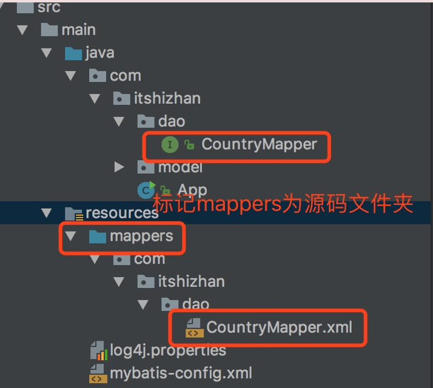

# chaper 1 第一章

#### 1. 如何分离mybatis 的xml 局部配置文件到resources 文件夹中，如下图：

# chapter 2 第二章

在MyBatis 中，数据库字段和Jave 类型的对应关系，不需要刻意记忆。但是，需要注意一个特殊的类型，`byte []`  ,这个类型一般对应数据库中的 BLOB、LONGVARCHAR, 以及一些二进制流有关的字段类型。

#### 特别注意

因为java 中基本类型会有默认值，因此，在某些情况下，无法实现是age位null。并且在动态sql的部分，如果使用 age!=null  进行判断，结果总会为true。所以，在实体类中不要使用基本类型。